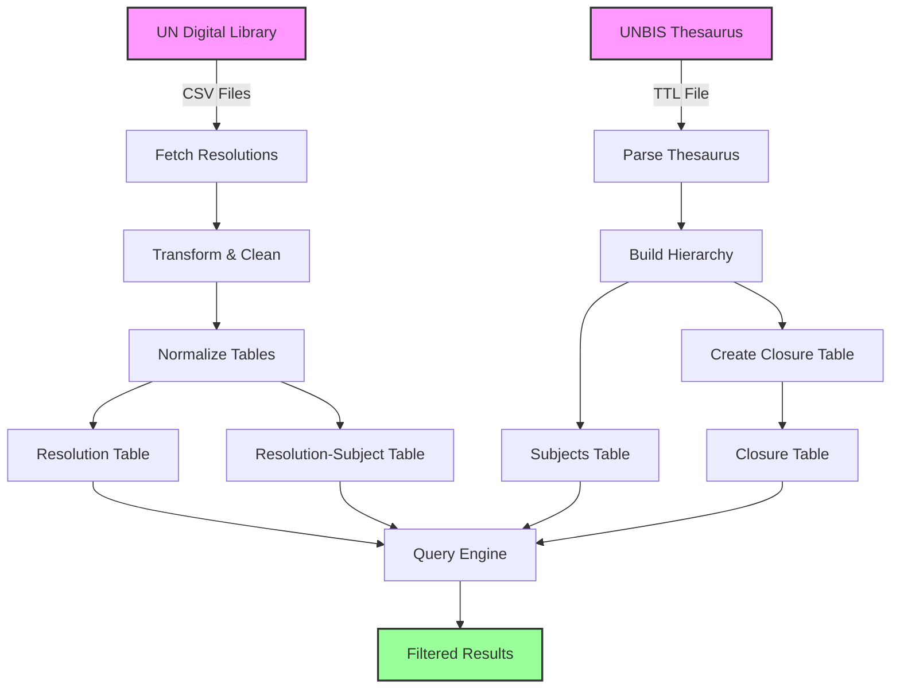

# UN Resolutions Data Pipeline

## Available Data Sources
### In use currently
- UN General Assembly Voting Data (.csv)
- UNBIS Thesaurus (.ttl)

### Potentially useful in the future
- UN Security Council Voting Data (.csv)
- SC Veto data (.csv)
- ...

## Data Pipeline Overview



The data pipeline consists of the following steps:

1. **Fetch Resolution**: Download the raw UN resolutions data from the source.
2. **Transform Resolutions**: Change structure to one row per resolution.
3. **Parse Subjects**: Subjects are currently a single string, that may contain multiple subjects. We create one row per resolution-subject pair.
4. **Fetch Thesaurus**: Download the thesaurus data from the source (TTL file)
5. **Parse Thesaurus Graph**: Parse the TTL file to extract the hierarchical relationships between subjects (using SKOS broader/narrower relationships).
6. **Create Subject Lookup Table**: Build a subject reference table with subject_id (URI), labels in different languages.
7. **Transform Subjects**: Change subject string to subject_id, which allows for multiple languages.
8. **Normalize Dataframe**: Create separate tables for resolutions and subjects, and a mapping table for resolution-subject pairs.
9. **Generate Closure Table**: Create a closure table that contains all ancestor-descendant pairs with their depths. This includes:
    - Self-references (each subject to itself at depth 0)
    - All transitive relationships (every ancestor-descendant pair with their distance)


## Implementation

The data pipeline is implemented in Python as a class called `UNResolutionAnalyzer`. The class handles data fetching, transformation, normalization, and querying. 

### Use Examples:

The class can be found in the file `resolution_analyzer.py`. A config file `data_sources.yaml` is used to specify the data sources, and other parameters. Here are a few examples of how to use the class:

```python
# Basic initialization with default configuration
analyzer = UNResolutionAnalyzer(config_path='config/data_sources.yaml')
``` 

```python
# 2. Query all resolutions (no filters)
all_resolutions = analyzer.query()
print(f"Total resolutions: {len(all_resolutions)}")
```

```python
# 3. Query by date range
date_filtered = analyzer.query(start_date='2000-01-01', end_date='2010-12-31')
print(f"Resolutions from 2000-2010: {len(date_filtered)}")
```

```python
# 4. Query by subject with descendants
# Using 'Political and Legal Questions' subject
political_legal_questions_resolutions = analyzer.query(
    subject_ids=['http://metadata.un.org/thesaurus/01'],
    include_descendants=True
)
print(f"Political and Legal Questions related resolutions: {len(political_legal_questions_resolutions)}")
```

```python
# 5. Query by subject without descendants
palestine_questions_resolutions = analyzer.query(
    subject_ids=['http://metadata.un.org/thesaurus/1004700'],
    include_descendants=False
)
print(f"Palestine Questions (strict) resolutions: {len(palestine_questions_resolutions)}")
```

```python
# 6. Combined query (date range and subject)
science_technology_recent = analyzer.query(
    start_date='2015-01-01',
    subject_ids=['http://metadata.un.org/thesaurus/16'],  # Science and technology
    include_descendants=True
)
print(f"Recent science and technology resolutions: {len(science_technology_recent)}")
```

### Implementation Details

- The class first checks if the URL is still valid. If yes, it checks if the data has already been processed and saved locally. If not, it downloads and processes the data.
- The current implementation of the class also already provide a query function that allows filtering by date range and subjects (with or without descendants). However, this may be split into a separate class in the future.
- The current implementation only uses general assembly data
- In the config file, you can specify:
  - URLs for the datasets
  - Local paths to save the processed data
  - Logging and verbosity settings

## Why this format?

We chose this format because we had to solve several issues:

1. Issue: Initial data format is one row per country vote. This is not a clean format for analysis.
    Solution: Since we only have around 200 countries, but thousands of resolutions, we can easily pivot the data to have one row per resolution and one column per country. This makes it more intuitive and easier to work with.
2. Issue: Initially subjects are encoded as a string, which may contain multiple subjects.
    Solution: We parse the strings, create a separate table for subjects and a mapping table for resolution-subject pairs. This allows for more flexible querying and analysis.
3. Issue: Subjects are hierarchical.
    Solution: We create a closure table to represent the hierarchy, allowing for efficient querying of all descendants of a given subject. Therefore users can query all subjects of a broad category efficiently.
4. Issue: Subjects are in different languages.
    Solution: We transform subjects into their IDs and can always look up the name in the desired language.
5. Issue: The resolution datasets get updated regularly.
    Solution: The implementation checks if the current URL is still valid. If not, it returns an error and hints the user to check for the new URL. 

## Next Steps
- It probably makes sense to split the querying and the data processing into two separate classes.
- Include Security Council data as well.
- We currently don't match all available subjects (only around ~70%). We should investigate how to improve this.